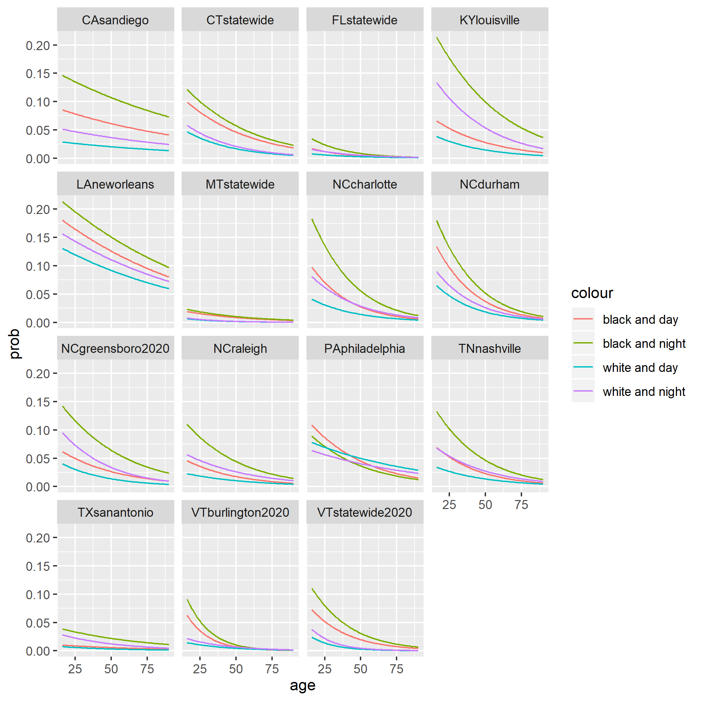

## Portfolio
---

### Spring and Summer of 2020

[Data Science Research Cricle](https://st47s-datascience.github.io/Chang-DSRC2020/)

---

### Summer of 2019
[Observing mouse behavior when stimulating the MPA-vPAG Circuit](https://github.com/oliverc1623/SummerResearch2019/blob/master/Observing%20mouse%20behavior%20when%20stimulating%20the%20vPAG.pdf)

---

## Movies

- [Project 1 Title](http://example.com/)
- [Project 2 Title](http://example.com/)
- [Project 3 Title](http://example.com/)
- [Project 4 Title](http://example.com/)
- [Project 5 Title](http://example.com/)

---

---

Page template forked from <a href="https://github.com/evanca/quick-portfolio">evanca</a>

<!-- Remove above link if you don't want to attibute -->
