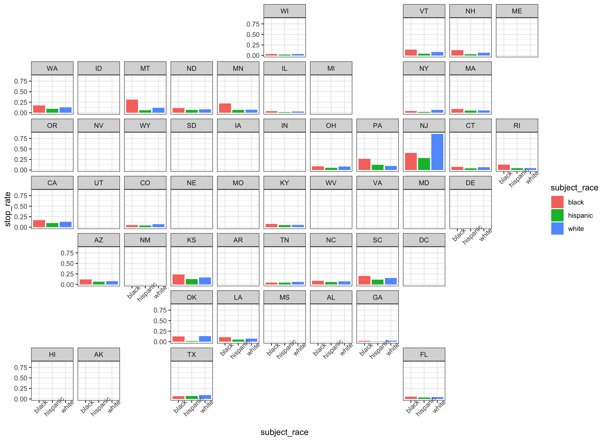
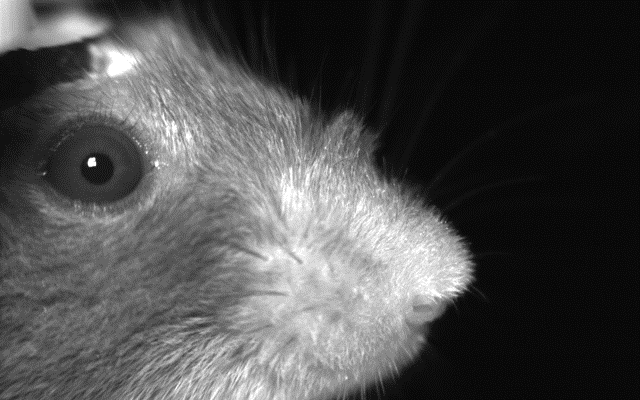

# Projects

## [A Reprise on Data Science Research Circle](final_project.html)

Fall 2020

Description: After taking computational statistics, I wanted to apply the newly learned techniques on my Data Science Research Circle Project.

---

## [Data Science Research Circle](https://st47s-datascience.github.io/Chang-DSRC2020/)

Spring/Summer 2020

Description: Analyzed police stops in multiple U.S. cities in collaboration with Emma Godfrey (‘21), Will Gray (‘22), Amber Lee (‘22), Ethan Ong (‘21), Arm Wonghirundacha, and Ivy Yuan (‘21). 

---

## [Observing mouse behavior when stimulating the MPA-vPAG Circuit](pdf/CaltechSummer2019.pdf)

Summer 2019

Description: Ran a behavioral project on mouse. Stimulating a certain neuron in the mouse's brain activates object craving behavior. We wanted to see if a mouse will display this craving head-fixed on a track ball.

---

## Movies List

- [Quarantine/Summer Movies](summer_movies.md)

---

---

Page template forked from <a href="https://github.com/evanca/quick-portfolio">evanca</a>

<!-- Remove above link if you don't want to attibute -->
