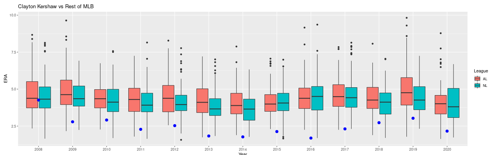

# [Projects](#projects) | [Contact](#contact) | 
---

## Projects

### [Benchmarking Policy-Gradient Methods for Deep Reinforcement Learning in High-Fidelity Autonomous Vehicles Simulators](pdf/main_640862.pdf)

My first PhD paper!

- Increased lane following and obstacle avoidance in a simulated self-driving car by 400 meters by applying a deep reinforcement learning algorithm that uses multiprocessing and dynamic programming, leading to faster bench marking by 3-fold.
- Improved training consistency from a correlation value of 0.18 to 0.39 by implementing a vision-based transformer and recurrent neural network, resulting in greater generalizability in PyTorch.
-  Accelerated learning speed by 20% by orchestrating a Nautilus Cluster to run 6 concurrent simulators to scale up training efforts, leading faster convergence in performance stability.
-  Expanded system to run on 3 additional open-source simulators by leading a team of five undergraduate
students who applied my algorithms. Tasks included code-reviews, user feedback, and debugging code.

---

### [ERA vs OPS](team_stats.html)

---

### [Baseball Pitcher Comparer](baseball.md)

In this project, I dabble with R and the Lahman package to illustrate a pitcher's performance compared to the rest of MLB.

---

### [CS152](cs152/outline.md)

---

### [A Reprise on Data Science Research Circle](final_project.html)

Fall 2020

Description: After taking computational statistics, I wanted to apply the newly learned techniques on my Data Science Research Circle Project.

---

## [Data Science Research Circle](https://st47s-datascience.github.io/Chang-DSRC2020/)

Spring/Summer 2020

Description: Analyzed police stops in multiple U.S. cities in collaboration with Emma Godfrey (‘21), Will Gray (‘22), Amber Lee (‘22), Ethan Ong (‘21), Arm Wonghirundacha, and Ivy Yuan (‘21). 

---

## [Observing mouse behavior when stimulating the MPA-vPAG Circuit](pdf/CaltechSummer2019.pdf)

Summer 2019

Description: Ran a behavioral project on mouse. Stimulating a certain neuron in the mouse's brain activates object craving behavior. We wanted to see if a mouse will display this craving head-fixed on a track ball.

---

## [Coding Progess](code_progress.md)

In an effort to track my software engineering skill level, I will posts my solutions to problems from Cracking the Coding Interview. 
The code I will post is code written in a text editor before checking if it runs correctly. This enforces that I thoroughly think 
about the problem and that data strcutures or algorithms I should utilize. Below each post is the solution from the textbook
and a brief description of what I should have done. This page will be updated frequently, as I reattempt problems and add new problems
from the book.

---

## Contact

<link rel="stylesheet" href="https://fonts.googleapis.com/icon?family=Material+Icons">
email elochang@ucsc.edu
 
location_on Santa Cruz, CA

---

## Movie List

- [Quarantine/Summer Movies](summer_movies.md)

---

Page template forked from <a href="https://github.com/evanca/quick-portfolio">evanca</a>

<!-- Remove above link if you don't want to attibute -->
