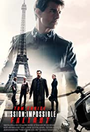
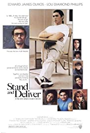
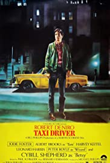
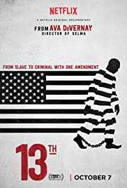

# Quarantine/Summer Movie List

Hello! I write this on August 23rd, 2020. One day before the start of my third year and fall semester of online school at Pomona College. The novel coronavirus has certainly made the spring and summer interesting. The biggest drawback coronavirus brought was having to social distance. Leaving Claremont felt disheartening, as with litimg social interaction with high school friends. However, among all the chaos in 2020, I am truly grateful for the amount of free time I had. Did I spend all of it wisely? Of course not. But it gave me a chance to reflect on life, work on personal projects, and (most entertainingly) watch movies. Here are the 22 movies I watched over the spring and summer ranked from least to most favorite. This list is just for fun. Don't take it seriously. 1

---

## 22. Julie & Julia

  
I don't know why I watched this, but I regret it. I like cooking shows and movies like The Great British Bake Off, Gordon Ramsay, and Chef. But I was very bored watching this movie. It was about a home cook cooking every recipe from a British lady's cookbook and writing about it in a blog. Enough said. 

---

## 21. The Curious Case of Benjamin Button

 
The first of two David Fincher movies on the list. A long movie filled with sleepy drama. I think my biggest problem was that I didn't really feel any emotional attachment to the protagonist. Given the first two movies on this list, I could just have a short attention span. 

---

## 20. Harold & Kumar Go to White Castle

I have never been a fan of raunchy, gross comedies. Harold and Kumar adds more full to my burning hatred towards these kinds of movies. As an Asian guy I appreciate Asian representation. But this movies does not bring that cause justice.

---

## 19. Uncut Gems

I will say, Uncut Gems was a rivetting watch. However, the ending really caught me off guard (no pun intended). I was kind of rooting for Adam Sandler's character to win his parlay, even though his character is not likeable. I guess I was looking for a satisfying ending. 

----

## 18. Minority Report

Interesting premise. I thought it was a regular action movie - nothing really stood out to me. I will say it did leave questioning about the logistics of the world. 

--- 

## 17. The Lighthouse

This is going to be a controversial one, but I didn't really enjoy The Lighthouse. The performances are great and elevate an already engaging story. But I just felt like the movie was a bit too disturbing for my taste. I'm sure on a technical level this movie is amazing, but for me it was not a fun watch. 

--- 

## 16. The Patriot 

Like Minority Report, I thought The Patriot was another standard action flick. The biggest difference is that Mel Gibson tries to deliver an epic feeling with M'urica patriotism, but it fell short for me. Especially, since current America doesn't have much to be patriotic about at the moment. 

---- 

## 15. Shazam! 

A fun, light-hearted movie. Nothing much else to say. 

---

## 14. Million Dollar Baby

Now going into this Million Dollar Baby, I was kind of expecting to watch a version of Rocky. However, the movie kind of shows the opposite. Either way it was a gripping movie. The first half was fun, as watch Hilary Swank's character defies expectations. At some point I was expecting Maggie to face some sort of challenge, but I didn't expect her strongest opponent ultimately killing her. A sad twist indeed, but tastefully portrayed. 

---

## 13. Mid90s

It's hard to like a movie like Mid90s. I always try to put the judgemental side of my head away when I watch a movie. For example, when the young kids in the movie drink or smoke weed, I can't help but to feel judgemental and want them to stop putting all the garbage in their body. But thankfully, Jonah Hill wrote the characters to likeable and realistic. I must I feel the like movie ended too soon. I wish I could've seen more of the character drama among the group of skaters. Instead, the movie ended with a car crash and hospitilization. 

---

## 12. Mission: Impossible - Fallout

Another Tom Cruz movie. Unlike Minority Report, Fallout's action is stunning. The movie knows not to take itself too seriously and just show the audience some top-notch stunts. 

---

## 11. Knives Out

Such a captivating film! Great performances, delivering an even greater story. Knives Out is a good example of subtly conveying a theme without making it obvious (I'm looking at you Last Jedi!) Pretty interesting to see Rian Johnson make Knives Out after Star Wars: The Last Jedi. I look forward to see what he does next. 

---

## 10. Stand and Deliver

I'm pretty biased on this one. As student who struggled with math in high school (and still struggle in college) Stand and Deliver strikes a chord in me. And plus this movie takes place in East LA, which is very close to my home! I think what the movie encapsulates best is that an excellent and patient teacher can positively change a student's life. It just takes some ganas. 

--- 

## 9. Jurassic Park

A classic. Jurassic Park has always been one of those movies I've seen chunks of when I was younger. But now that the whole movie is on Netflix I gave it a go and watch the entire film for once. I was thoroughly entertained. In addition to the adventure, I thought it made good thematic nods to the ethics involving bringing dinosaurs back to life. While the special effects are starting to age compared to what modern studios produce, you still got to appreciate it's technical strides in expanding movie magic. 

---

## 8. Taxi Driver

Such a compelling character study. Even though Travis is troubled person, the movie knows how to connect the audience with him through an immersive, and realistic world. Interesting to see some of the elements in this movie that, presumably, influenced Joker. I'll be honest it took me about half way into the movie until I realized Travis is played by Robert DeNiro. I guess I'm just use to seeing him at an older age.

---

## 7. 13th

The one and only documentary on this list. I usually don't like documentaries because they come off as giant sale pitches. However, the 13th truly sheds light on system racism through various case studies and empirical evidence. Goes to show that when racism is such a prevalent issue in the Untied States, you don't need to sell someone on that idea. You just show the facts, and the 13th effectively does that. 

---

## 6. 1917

Arguably the most visually impressive movie on the list. Just a simple story executed brilliantly. Not much more to say. 

---

## 5. The Florida Project

Like the 13th, The Florida Project portrays the grimmer reality many Americans face. The biggest thing I love about this movie is how poverty is conveyed through the point of view of a kid. The naive, innocence of the kinds reveal how they manage to have fun in what is an unacceptable living environment. I honestly just relate to this movie a lot. It reminds me of how brother and I played outdoors all the time, oblivious to the financial hardships my mom and dad faced during the great recession. 

--- 

## 4. Glory

Glory has to be one of my favorite war films. The best component of the movie are definitely the characters. The main cast of characters are dynamic and you grow on them as they learn to cooperate together. Another aspect I enjoyed was that our protagonists lose in the end. It's different than Michael Bay or Mel Gibson's style in a good way. The movie could've easily gone all hollywood and shown our protagonist beat everyone up with an American flag. However, having them lose is not only historically accurate, but highlights the real glorious moment from the movie: the influence the 54th had on history. 

---

## 3. Zodiac

Hands down one of my favorite movies I watch this summer. I love the kind of movies where a group of characters are working together to solve a problem. It's engaging for the audience because they are also put in the mindset of the characters. That's why I believe Zodiac is a very engaging film riddled with intense, thrilling moments. 

---

## 2. The Good, the Bad, and the Ugly

You know a three hour movie is good when it goes by quickly. The Good, the Bad, and the Ugly takes the number two spot. I love this movie. The badass characters, music score, and compelling adventures the three characters go through truly make this film an epic classic. Of course, the last duel among the three has to be my favorite movie ending of all time. I mean it's a scene where three men stare at each other. Yet, Sergio Leone, the score, and tasteful editing, managed to make the final duel my favorite movie scene. Put it simply, it's a master piece. 

---

## 1. Lady Bird

I absolutely love this movie. It's a coming of age movie about a high school girl's last year of high school and transition into college life. I don't know where to begin. I relate to it so much because I graduated from high school two year ago, and the film hits the emotional feelings I had going through that time. What's even more relatable is that the movie was filmed at my High School! It was honestly such an enjoyable watch. Few movies leave me pondering about my life.

---
1 I am by no means a movie expert. These are just opinions given from the point of view of a CS college student. 